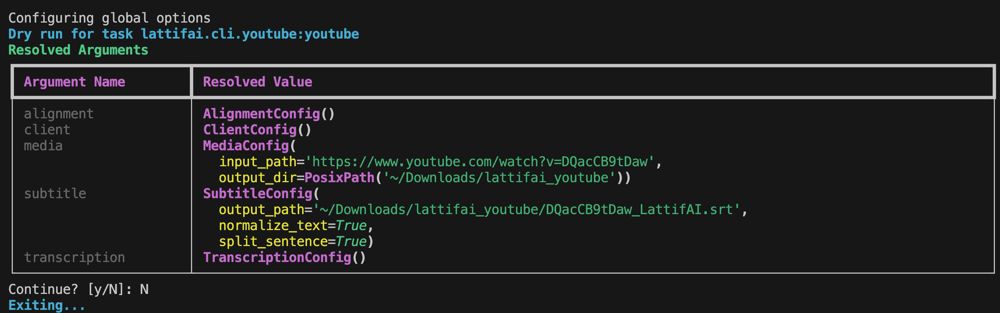

<div align="center">


[](https://badge.fury.io/py/lattifai)
[](https://pypi.org/project/lattifai)
[](https://pepy.tech/project/lattifai)
</div>

<p align="center">
   🌐 <a href="https://lattifai.com"><b>Official Website</b></a> &nbsp&nbsp | &nbsp&nbsp 🖥️ <a href="https://github.com/lattifai/lattifai-python">GitHub</a> &nbsp&nbsp | &nbsp&nbsp 🤗 <a href="https://huggingface.co/Lattifai/Lattice-1-Alpha">Model</a> &nbsp&nbsp | &nbsp&nbsp 📑 <a href="https://lattifai.com/blogs">Blog</a> &nbsp&nbsp | &nbsp&nbsp <a href="https://discord.gg/kvF4WsBRK8"></a>
</p>


# LattifAI: Precision Alignment, Infinite Possibilities

Advanced forced alignment and subtitle generation powered by [Lattice-1-Alpha](https://huggingface.co/Lattifai/Lattice-1-Alpha) model.

## Roadmap

Visit our [LattifAI roadmap](https://lattifai.com/roadmap) for the latest updates and planned features.

| Date | Release | Key Features |
|------|---------|--------------|
| **Oct 7, 2024** | **Lattice-1-Alpha** | ✅ English-only forced alignment<br>✅ Multiple media&subtitle format support<br>✅ CPU/GPU optimization |
| **Nov 30, 2024** | **Lattice-1** | 🚀 English + Chinese + German support<br>🚀 Mixed language alignment<br>🚀 WIP: Integrate Speaker Diarization technology<br>🚀 WIP: Support up to 20 hours of continuous audio/video processing |

## Installation

### Recommended: Using uv (Fast & Modern)

[uv](https://github.com/astral-sh/uv) is a fast Python package installer and resolver written in Rust. It's **10-100x faster** than pip and provides better dependency resolution.

```bash
# Install uv if you haven't already
curl -LsSf https://astral.sh/uv/install.sh | sh

# Create a new project with uv
uv init my-project
cd my-project

uv init
source .venv/bin/activate

# Install k2 (required dependency)
uv pip install install-k2
uv run install-k2

# Install LattifAI
uv add lattifai
```

### Alternative: Using pip

```bash
pip install install-k2
# The installation will automatically detect and use your already installed PyTorch version(up to 2.9).
install-k2  # Install k2

pip install lattifai
```

> **⚠️ Important**: You must run `install-k2` before using the lattifai library.
```
> install-k2 help
usage: install-k2 [-h] [--system {linux,darwin,windows}] [--dry-run] [--torch-version TORCH_VERSION]

Auto-install the latest k2 wheel for your environment.

optional arguments:
  -h, help            show this help message and exit
  system {linux,darwin,windows}
                        Override OS detection. Valid values: linux, darwin (macOS), windows. Default: auto-detect
  dry-run             Show what would be installed without making changes.
  torch-version TORCH_VERSION
                        Specify torch version (e.g., 2.8.0). If not specified, will auto-detect or use latest available.
```


## Quick Start

### API Key Setup

First, create your API key at [https://lattifai.com/dashboard/api-keys](https://lattifai.com/dashboard/api-keys)

**Recommended: Using .env file**

1. Copy the example environment file:
```bash
cp .env.example .env
```

2. Edit `.env` and add your API key:
```bash
# LattifAI API_KEY at: https://lattifai.com/dashboard/api-keys
LATTIFAI_API_KEY=your_api_key_here  # lf_xxxx

# Gemini API KEY at: https://aistudio.google.com/api-keys (Optional)
# Only required if you choose to use Gemini for audio/video transcription
# You can safely skip this if you're only doing alignment with existing subtitles
GEMINI_API_KEY=your_gemini_api_key_here  # AIzaSyxxxx
```

The library automatically loads the `.env` file (python-dotenv is included as a dependency).

**Alternative: Environment variable**
```bash
export LATTIFAI_API_KEY="your-api-key"
export GEMINI_API_KEY="your_gemini_api_key_here"  # Optional, only for transcription
```
> **💡 Tip**: Get your free **LattifAI API key** at [https://lattifai.com/dashboard/api-keys](https://lattifai.com/dashboard/api-keys)

> **💡 Tip**: Get your free **Gemini API key** at [https://aistudio.google.com/apikey](https://aistudio.google.com/apikey) (Optional - only needed for automatic transcription)


### Command Line Interface

LattifAI provides a powerful CLI powered by [NeMo Run](https://github.com/lattifai/Run), offering flexible configuration management and execution capabilities.

```bash
# Align audio with subtitle
lai alignment align audio.wav subtitle.srt output.srt

# Download and align YouTube content
lai alignment youtube "https://youtube.com/watch?v=VIDEO_ID"

# Convert subtitle formats
lai subtitle convert input.srt output.vtt

# Normalize subtitle text (clean HTML entities)
lai subtitle normalize input.srt output.srt

# Shift subtitle timestamps
lai subtitle shift input.srt output.srt 2.0
```

> **💡 New to NeMo Run?** Check out the [Configuration Guide](#advanced-configuration-with-nemo-run) below to learn about powerful features like YAML configs, config reuse, and parameter sweeps.

```bash
lai alignment youtube "https://www.youtube.com/watch?v=DQacCB9tDaw" \
    media.output_dir=~/Downloads/lattifai_youtube \
    subtitle.split_sentence=true \
    subtitle.normalize_text=true \
    subtitle.output_path=~/Downloads/lattifai_youtube/DQacCB9tDaw_LattifAI.srt
```




#### Command Quick Reference

| Command | Use Case | Best For |
|---------|----------|----------|
| `lai alignment align` | Align existing audio/video + subtitle files | Local files, custom workflows |
| `lai alignment youtube` | Download & align YouTube content | Quick YouTube processing with/without existing subtitles |
| `lai subtitle convert` | Convert subtitle formats | Format conversion only |
| `lai subtitle normalize` | Clean and normalize subtitle text | Text preprocessing |
| `lai subtitle shift` | Shift subtitle timestamps | Adjust timing offset |
| ~~`lai agent workflow(under construction)`~~ | Intelligent YouTube workflow with transcription | Production, batch jobs, full automation |


#### lai alignment align

Align audio/video with subtitle files using forced alignment.

**Basic Usage:**
```bash
# Simple alignment
lai alignment align audio.wav subtitle.srt output.srt

# With GPU acceleration
lai alignment align audio.wav subtitle.srt output.srt alignment.device=cuda

# Smart sentence splitting and normalize text
lai alignment align audio.wav subtitle.srt output.vtt \
    subtitle.split_sentence=true \
    subtitle.normalize_text=true
```

**Common Options:**
- First argument: Path to audio/video file (or use `input_media=`)
- Second argument: Path to subtitle file (or use `input_subtitle_path=`)
- Third argument: Output path for aligned subtitle (or use `output_subtitle_path=`)
- `subtitle.split_sentence=true`: Enable intelligent sentence splitting
- `alignment.device=cuda`: Device to use (`cpu`, `cuda`, or `mps`)
- `alignment.model_name=MODEL`: Model to use for alignment

#### lai alignment youtube

Download media and optionally subtitles from YouTube, then perform forced alignment.

**Basic Usage:**
```bash
# Basic YouTube alignment (downloads YouTube subtitles automatically)
lai alignment youtube "https://youtube.com/watch?v=VIDEO_ID"

# Custom output directory and format
lai alignment youtube "https://youtube.com/watch?v=VIDEO_ID" \
    media.output_dir=/tmp/youtube \
    media.output_format=wav

# Full configuration with smart splitting
lai alignment youtube "https://youtube.com/watch?v=VIDEO_ID" \
    subtitle.output_path=aligned.srt \
    subtitle.split_sentence=true \
    alignment.device=mps
```

**Common Options:**
- First argument: YouTube URL (or use `yt_url=`)
- `media.output_dir=/path`: Directory for downloaded media
- `media.output_format=mp3`: Media format (`mp3`, `wav`, `mp4`, etc.)
- `subtitle.output_path=file.srt`: Output path for aligned subtitle
- `alignment.device=cuda`: Device to use for alignment

#### lai agent workflow (under construction)

Run the intelligent agentic YouTube workflow with automatic transcription, alignment, and export.

This command provides a complete end-to-end pipeline:
1. Download media from YouTube URL
2. Transcribe audio/video using Gemini API or Local Transcription model
3. Align transcription with audio/video
4. Export results in the desired format

#### lai subtitle convert

Convert subtitle files between different formats.

**Basic Usage:**
```bash
# Basic format conversion
lai subtitle convert input.srt output.vtt

# Convert with text normalization
lai subtitle convert input.srt output.json normalize_text=true
```

**Arguments:**
- First argument: Input subtitle file path
- Second argument: Output subtitle file path
- `include_speaker_in_text=true`: Include speaker labels in text
- `normalize_text=true`: Normalize text during conversion

#### lai subtitle normalize

Normalize subtitle text by cleaning HTML entities, tags, and whitespace.

**Basic Usage:**
```bash
# Normalize in-place
lai subtitle normalize input.srt input.srt

# Normalize and save to new file
lai subtitle normalize input.srt output.srt

# Normalize with format conversion
lai subtitle normalize input.vtt output.srt
```

**Arguments:**
- First argument: Input subtitle file path
- Second argument: Output subtitle file path

#### lai subtitle shift

Shift subtitle timestamps by a specified number of seconds.

**Basic Usage:**
```bash
# Delay subtitles by 2 seconds
lai subtitle shift input.srt output.srt 2.0

# Make subtitles appear 1.5 seconds earlier
lai subtitle shift input.srt output.srt -1.5

# Shift in-place
lai subtitle shift input.srt input.srt -0.5

# Using shortcut command
laisub-shift input.srt output.srt 3.0

# Shift and convert format
lai subtitle shift input.vtt output.srt seconds=0.5
```

**Arguments:**
- First argument: Input subtitle file path
- Second argument: Output subtitle file path
- Third argument: Seconds to shift (positive = delay, negative = advance)
- `seconds=N`: Alternative way to specify the shift amount

#### Understanding split_sentence

The `split_sentence` option performs intelligent sentence re-splitting based on punctuation and semantic boundaries. This is especially useful when processing subtitles that combine multiple semantic units in a single segment, such as:

- **Mixed content**: Non-speech elements (e.g., `[APPLAUSE]`, `[MUSIC]`) followed by actual dialogue
- **Natural punctuation boundaries**: Colons, periods, and other punctuation marks that indicate semantic breaks
- **Concatenated phrases**: Multiple distinct utterances joined together without proper separation

**Example transformations**:
```
Input:  "[APPLAUSE] >> MIRA MURATI: Thank you all"
Output: ["[APPLAUSE]", ">> MIRA MURATI: Thank you all"]

Input:  "[MUSIC] Welcome back. Today we discuss AI."
Output: ["[MUSIC]", "Welcome back.", "Today we discuss AI."]
```

This feature helps improve alignment accuracy by:
1. Respecting punctuation-based semantic boundaries
2. Separating distinct utterances for more precise timing
3. Maintaining semantic context for each independent phrase

**Usage**:
```bash
lai alignment align subtitle.split_sentence=true \
                    media.input_path=audio.wav \
                    subtitle.input_path=subtitle.srt \
                    subtitle.output_path=output.srt
```

#### Understanding word_level

The `word_level` option enables word_level alignment, providing precise timing information for each individual word in the audio. When enabled, the output includes detailed word boundaries within each subtitle segment, allowing for fine-grained synchronization and analysis.

**Key features**:
- **Individual word timestamps**: Each word gets its own start and end time
- **Format-specific output**:
  - **JSON (Recommended)**: Full alignment details stored in `alignment.word` field of each segment, preserving all word_level timing information in a structured format
  - **TextGrid**: Separate "words" tier alongside the "utterances" tier for linguistic analysis
  - **TXT**: Each word on a separate line with timestamp range: `[start-end] word`
  - **Standard subtitle formats** (SRT, VTT, ASS, etc.): Each word becomes a separate subtitle event

> **💡 Recommended**: Use JSON format (`output.json`) to preserve complete word_level alignment data. Other formats may lose some structural information.

**Example output formats**:

**JSON format** (with word_level details):
```json
[
{
  "id": "6",
  "recording_id": "",
  "start": 24.52,
  "duration": 9.1,
  "channel": 0,
  "text": "We will start with why it is so important to us to have a product that we can make truly available and broadly available to everyone.",
  "custom": {
    "score": 0.8754
  },
  "alignment": {
    "word": [
      [
        "We",
        24.6,
        0.14,
        1.0
      ],
      [
        "will",
        24.74,
        0.14,
        1.0
      ],
      [
        "start",
        24.88,
        0.46,
        0.771
      ],
      [
        "with",
        25.34,
        0.28,
        0.9538
      ],
      [
        "why",
        26.2,
        0.36,
        1.0
      ],
      [
        "it",
        26.56,
        0.14,
        0.9726
      ],
      [
        "is",
        26.74,
        0.02,
        0.6245
      ],
      [
        "so",
        26.76,
        0.16,
        0.6615
      ],
      [
        "important",
        26.92,
        0.54,
        0.9257
      ],
      [
        "to",
        27.5,
        0.1,
        1.0
      ],
      [
        "us",
        27.6,
        0.34,
        0.7955
      ],
      [
        "to",
        28.04,
        0.08,
        0.8545
      ],
      [
        "have",
        28.16,
        0.46,
        0.9994
      ],
      [
        "a",
        28.76,
        0.06,
        1.0
      ],
      [
        "product",
        28.82,
        0.56,
        0.9975
      ],
      [
        "that",
        29.38,
        0.08,
        0.5602
      ],
      [
        "we",
        29.46,
        0.16,
        0.7017
      ],
      [
        "can",
        29.62,
        0.22,
        1.0
      ],
      [
        "make",
        29.84,
        0.32,
        0.9643
      ],
      [
        "truly",
        30.42,
        0.32,
        0.6737
      ],
      [
        "available",
        30.74,
        0.6,
        0.9349
      ],
      [
        "and",
        31.4,
        0.2,
        0.4114
      ],
      [
        "broadly",
        31.6,
        0.44,
        0.6726
      ],
      [
        "available",
        32.04,
        0.58,
        0.9108
      ],
      [
        "to",
        32.72,
        0.06,
        1.0
      ],
      [
        "everyone.",
        32.78,
        0.64,
        0.7886
      ]
    ]
  }
}
]
```

**TXT format** (word_level):
```
[0.50-1.20] Hello
[1.20-2.30] world
```

**TextGrid format** (Praat-compatible):
```
Two tiers created:
- "utterances" tier: Full segments with original text
- "words" tier: Individual words with precise boundaries
```

**Use cases**:
- **Linguistic analysis**: Study pronunciation patterns, speech timing, and prosody
- **Accessibility**: Create more granular captions for hearing-impaired users
- **Video/Audio editing**: Enable precise word_level subtitle synchronization
- **Karaoke applications**: Highlight individual words as they are spoken
- **Language learning**: Provide precise word boundaries for pronunciation practice


### Advanced Configuration with LattifAI Run

LattifAI CLI is built on [NeMo Run](https://github.com/lattifai/Run), a powerful configuration and execution framework that provides:

- **📋 YAML-based Configurations**: Define reusable configuration files
- **🔧 Pythonic Config Objects**: Use `run.Config` for type-safe parameter management
- **🎯 Config Composition**: Combine multiple configuration files
- **🔄 Parameter Sweeps**: Run experiments with different parameter combinations
- **📦 Config Reuse**: Share configurations across different commands

> **Note**: We use a customized version of [NVIDIA NeMo Run](https://github.com/NVIDIA-NeMo/Run) tailored for LattifAI's workflow requirements. For full documentation, visit [https://github.com/lattifai/Run](https://github.com/lattifai/Run).

> **💡 All Configuration Options**: See [`src/lattifai/config`](https://github.com/lattifai/lattifai-python/tree/main/src/lattifai/config) for complete configuration schemas and available parameters.

#### Using Configuration Files

**1. Create a YAML configuration file:**

```yaml
# config/media.yaml
input_path: "audio.wav"
output_dir: "/tmp/output"
output_format: "wav"
prefer_audio: true
force_overwrite: false

# config/subtitle.yaml
input_path: "subtitle.srt"
output_path: "output.srt"
output_format: "srt"
split_sentence: true
word_level: true
normalize_text: true

# config/alignment.yaml
model_name: "Lattifai/Lattice-1-Alpha"
device: "mps"
batch_size: 1
```

**2. Use the configuration file:**

```bash
# Load configuration from YAML files
lai alignment align media=config/media.yaml \
                    subtitle=config/subtitle.yaml \
                    alignment=config/alignment.yaml

# Override specific parameters
lai alignment align media=config/media.yaml \
                    media.input_path=different_audio.wav \
                    subtitle=config/subtitle.yaml \
                    alignment.device=cuda
```

#### Benefits of Configuration Files

1. **Reusability**: Define once, use across multiple experiments
2. **Reproducibility**: Version control your configurations
3. **Documentation**: Configs serve as self-documenting code
4. **Team Collaboration**: Share standardized configurations
5. **Environment Flexibility**: Easy switching between dev/prod settings

For more advanced features like parameter sweeps and experiment management, see the [LattifAI Run documentation](https://github.com/lattifai/Run/tree/main/docs).

### Python API

```python
from lattifai import LattifAI

client = LattifAI()
alignments, output_path = client.alignment(
    input_media="audio.wav",
    input_subtitle_path="subtitle.srt",
    output_subtitle_path="output.srt",
    input_subtitle_format=None,  # Optional: auto-detect from file extension
    split_sentence=None,  # Optional: uses config default if None
)
```

Need to run inside an async application? Use the drop-in asynchronous client:

```python
import asyncio
from lattifai import AsyncLattifAI


async def main():
    async with AsyncLattifAI() as client:
        alignments, output_path = await client.alignment(
            input_media="audio.wav",
            input_subtitle_path="subtitle.srt",
            output_subtitle_path="output.srt",
            input_subtitle_format=None,  # Optional: auto-detect from file extension
            split_sentence=None,  # Optional: uses config default if None
        )


asyncio.run(main())
```

Both clients return a list of `Supervision` segments with timing information and, if provided, the path where the aligned subtitle was written.

### Configuration Objects

LattifAI uses a config-driven architecture with three main configuration classes:

#### ClientConfig

```python
from lattifai import ClientConfig

config = ClientConfig(
    api_key="your-api-key",        # Optional: defaults to LATTIFAI_API_KEY env var
    base_url="https://api.lattifai.com",  # API base URL
    timeout=30.0,                   # Request timeout in seconds
    max_retries=3,                  # Maximum retry attempts
)

client = LattifAI(client_config=config)
```

#### AlignmentConfig

```python
from lattifai import AlignmentConfig

config = AlignmentConfig(
    model_name="Lattifai/Lattice-1-Alpha",  # Model identifier or local path
    device="cpu",                   # Device: "cpu", "cuda", "cuda:0", "mps"
    batch_size=1,                   # Batch size for processing
)

client = LattifAI(alignment_config=config)
```

#### SubtitleConfig

```python
from lattifai import SubtitleConfig

config = SubtitleConfig(
    input_path=None,                # Default input path
    output_path=None,               # Default output path
    input_format=None,              # Input format (auto-detect if None)
    output_format=None,             # Output format (same as input if None)
    split_sentence=False,           # Enable sentence re-splitting
    word_level=False,               # Include word-level timestamps
    normalize_text=True,            # Normalize text (clean HTML entities)
    include_speaker_in_text=False,  # Include speaker labels in text
)

client = LattifAI(subtitle_config=config)
```

#### Using All Configs Together

```python
from lattifai import LattifAI, ClientConfig, AlignmentConfig, SubtitleConfig

client = LattifAI(
    client_config=ClientConfig(
        api_key="your-api-key",
        timeout=60.0,
    ),
    alignment_config=AlignmentConfig(
        model_name="Lattifai/Lattice-1-Alpha",
        device="cuda",
    ),
    subtitle_config=SubtitleConfig(
        split_sentence=True,
        word_level=True,
        output_format="json",
    ),
)

alignments, output_path = client.alignment(
    input_media="audio.wav",
    input_subtitle_path="subtitle.srt",
    output_subtitle_path="output.json",
)
```

## Supported Formats

**Audio**: WAV, MP3, M4A, AAC, FLAC, OGG, OPUS, AIFF

**Video**: MP4, MKV, MOV, WEBM, AVI

**Subtitle Input**: SRT, VTT, ASS, SSA, SUB, SBV, TXT (plain text), Gemini (Google Gemini transcript format)

**Subtitle Output**: All input formats plus TextGrid (Praat format for linguistic analysis)

## Development

### Setup

We recommend using [uv](https://github.com/astral-sh/uv) for development:

```bash
# Clone the repository
git clone https://github.com/lattifai/lattifai-python.git
cd lattifai-python

# Install uv if you haven't already
curl -LsSf https://astral.sh/uv/install.sh | sh

# Sync dependencies (creates .venv automatically)
uv sync

# Activate the virtual environment
source .venv/bin/activate  # On macOS/Linux
# or
.venv\Scripts\activate  # On Windows

# Install pre-commit hooks
pre-commit install
```

**Alternative with pip:**

```bash
git clone https://github.com/lattifai/lattifai-python.git
cd lattifai-python
pip install -e ".[test]"
pre-commit install
```

### Testing

```bash
pytest                        # Run all tests
pytest cov=src             # With coverage
pytest tests/test_basic.py   # Specific test
```

### Code Quality

```bash
pre-commit run
```

## Contributing

1. Fork the repository
2. Create a feature branch
3. Make changes and add tests
4. Run `pytest` and `pre-commit run`
5. Submit a pull request

## License

Apache License 2.0

## Support

- **Issues**: [GitHub Issues](https://github.com/lattifai/lattifai-python/issues)
- **Discussions**: [GitHub Discussions](https://github.com/lattifai/lattifai-python/discussions)
- **Discord**: [Join our community](https://discord.gg/kvF4WsBRK8)
