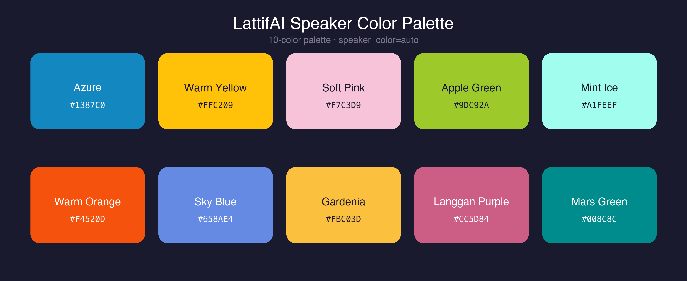
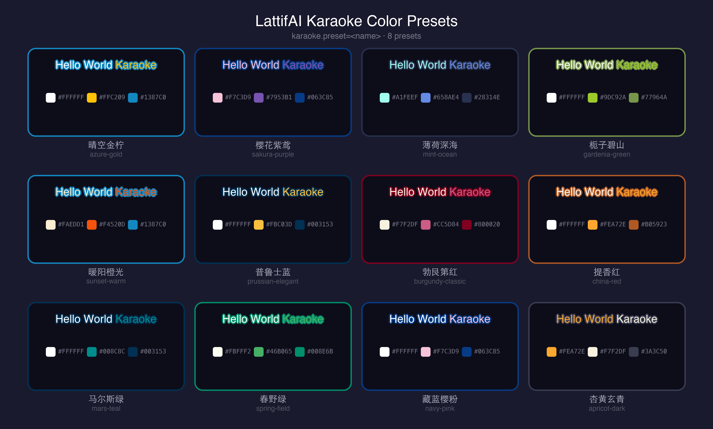

<div align="center">


[](https://badge.fury.io/py/lattifai)
[](https://pypi.org/project/lattifai)
[](https://pepy.tech/project/lattifai)
</div>

<p align="center">
   🌐 <a href="https://lattifai.com"><b>Official Website</b></a> &nbsp;&nbsp; | &nbsp;&nbsp; 🖥️ <a href="https://github.com/lattifai/lattifai-python">GitHub</a> &nbsp;&nbsp; | &nbsp;&nbsp; 🤗 <a href="https://huggingface.co/LattifAI/Lattice-1">Model</a> &nbsp;&nbsp; | &nbsp;&nbsp; 📑 <a href="https://lattifai.com/blogs">Blog</a> &nbsp;&nbsp; | &nbsp;&nbsp; <a href="https://discord.gg/kvF4WsBRK8"></a>
</p>


# LattifAI: Precision Alignment, Infinite Possibilities

Advanced forced alignment and subtitle generation powered by [ 🤗 Lattice-1](https://huggingface.co/LattifAI/Lattice-1) model.

## Table of Contents

- [Features](#features)
- [Installation](#installation)
- [Quick Start](#quick-start)
- [CLI Reference](#cli-reference)
  - [Translation](#lai-translate-caption)
- [Python SDK](#python-sdk)
- [Advanced Features](#advanced-features)
- [Text Processing](#text-processing)
- [Supported Formats & Languages](#supported-formats--languages)
- [Roadmap](#roadmap)
- [Development](#development)

---

## Features

| Feature | Description |
|---------|-------------|
| **Forced Alignment** | Word-level and segment-level audio-text synchronization powered by [Lattice-1](https://huggingface.co/LattifAI/Lattice-1) |
| **Multi-Model Transcription** | Gemini, Parakeet, SenseVoice, Fun-ASR, Qwen3-ASR, Whisper, and any vLLM/SGLang-served model |
| **Speaker Diarization** | Multi-speaker identification with label preservation |
| **Caption Translation** | LLM-powered translation with terminology consistency and bilingual output |
| **Streaming Mode** | Process audio up to 20 hours with minimal memory |
| **Universal Format Support** | 30+ caption/subtitle formats |

### Alignment Models

| Model | Links | Languages | Description |
|-------|-------|-----------|-------------|
| **Lattice-1** | [🤗 HF](https://huggingface.co/LattifAI/Lattice-1) • [🤖 MS](https://modelscope.cn/models/LattifAI/Lattice-1) | English, Chinese, German | Production model with mixed-language alignment support |
| **Lattice-1-Alpha** | [🤗 HF](https://huggingface.co/LattifAI/Lattice-1-Alpha) • [🤖 MS](https://modelscope.cn/models/LattifAI/Lattice-1-Alpha) | English | Initial release with English forced alignment |

**Model Hub**: Models can be downloaded from `huggingface` (default) or `modelscope` (recommended for users in China):

```bash
# Use ModelScope (faster in China)
lai alignment align audio.wav caption.srt output.srt alignment.model_hub=modelscope
```

```python
from lattifai.client import LattifAI
from lattifai.config import AlignmentConfig

client = LattifAI(alignment_config=AlignmentConfig(model_hub="modelscope"))
```

---

## Installation

> **Requires Python 3.10 – 3.14**

### Using uv (Recommended)

[uv](https://github.com/astral-sh/uv) is a fast Python package manager (10-100x faster than pip).

```bash
# Install uv (skip if already installed)
curl -LsSf https://astral.sh/uv/install.sh | sh
```

**As a CLI tool** (recommended for most users):

```bash
# Install globally — lai command available everywhere
uv tool install "lattifai[all]" --extra-index-url https://lattifai.github.io/pypi/simple/

# Quick test without installing
uvx --from lattifai --extra-index-url https://lattifai.github.io/pypi/simple/ lai --help
```

**As a project dependency** (for Python SDK usage):

```bash
# Add to an existing project
uv add "lattifai[all]" --extra-index-url https://lattifai.github.io/pypi/simple/
```

### Using pip

```bash
# Full installation (recommended)
pip install "lattifai[all]" --extra-index-url https://lattifai.github.io/pypi/simple/
```

**Configure pip globally** (optional, to avoid `--extra-index-url` each time):

```bash
# Add to ~/.pip/pip.conf (Linux/macOS) or %APPDATA%\pip\pip.ini (Windows)
[global]
extra-index-url = https://lattifai.github.io/pypi/simple/
```

### Installation Options

| Extra | Includes |
|-------|----------|
| (base) | Forced alignment, Gemini transcription, YouTube, captions |
| `transcription` | Local ASR models (Parakeet, SenseVoice, Fun-ASR) |
| `diarization` | Speaker diarization (NeMo, pyannote) |
| `translation` | LLM-powered caption translation (OpenAI-compatible) |
| `event` | Audio event detection |
| `all` | Base + transcription + diarization + translation + event |

**Note:** Base installation includes alignment, Gemini transcription, and YouTube. Use `[all]` for local ASR models and all optional features.

### Caption Format Support

Caption/subtitle format parsing is provided by [lattifai-captions](https://github.com/lattifai/captions), a separate package supporting 30+ formats (SRT, VTT, ASS, TTML, TextGrid, NLE formats, etc.). It is automatically installed with `lattifai`.

### API Keys

**LattifAI API Key (Required)** - Get your free key at [lattifai.com/dashboard/api-keys](https://lattifai.com/dashboard/api-keys), or try instantly with `lai auth trial`.

**Gemini API Key (Optional)** - For transcription with Gemini models, get key at [aistudio.google.com/apikey](https://aistudio.google.com/apikey)

#### Configuration Priority

Keys and URLs are resolved in this order (first match wins):

1. **Environment variable** — `export LATTIFAI_API_KEY=lf_xxx`
2. **CLI session** (`~/.lattifai/config.toml`) — written by `lai auth login` / `lai auth trial`, device-bound obfuscated storage
3. **`.env` file** — auto-discovered from current directory upward

```bash
# Option 1: Environment variable
export LATTIFAI_API_KEY="lf_your_api_key_here"
export GEMINI_API_KEY="your_gemini_api_key_here"

# Option 2: CLI login (opens browser, stores key securely)
lai auth login

# Option 3: Free trial (no sign-up, 120 minutes)
lai auth trial

# Option 4: .env file in project root
cat > .env <<EOF
LATTIFAI_API_KEY=lf_your_api_key_here
LATTIFAI_BASE_URL=https://api.lattifai.com/v1
GEMINI_API_KEY=your_gemini_api_key_here
EOF
```

The same resolution order applies to `LATTIFAI_BASE_URL` and `LATTIFAI_SITE_URL`.

---

## Quick Start

### Command Line

```bash
# Align audio with subtitle
lai alignment align audio.wav subtitle.srt output.srt

# YouTube video
lai youtube align "https://youtube.com/watch?v=VIDEO_ID"

# Start local browser playground (4 tabs)
lai serve run
```

### Python SDK

```python
from lattifai.client import LattifAI

client = LattifAI()
caption = client.alignment(
    input_media="audio.wav",
    input_caption="subtitle.srt",
    output_caption_path="aligned.srt",
)
```

---

## CLI Reference

| Command | Description | Example |
|---------|-------------|---------|
| `lai alignment align` | Align audio/video with caption | `lai alignment align audio.wav caption.srt output.srt` |
| `lai youtube align` | Download & align YouTube | `lai youtube align "https://youtube.com/watch?v=ID"` |
| `lai transcribe run` | Transcribe audio/video | `lai transcribe run audio.wav output.srt` |
| `lai transcribe align` | Transcribe and align | `lai transcribe align audio.wav output.srt` |
| `lai translate caption` | Translate captions | `lai translate caption input.srt output.srt translation.target_lang=zh` |
| `lai caption convert` | Convert caption formats | `lai caption convert input.srt output.vtt` |
| `lai caption shift` | Shift timestamps | `lai caption shift input.srt output.srt 2.0` |
| `lai serve run` | Start local web UI playground | `lai serve run` |
| `lai doctor` | Run environment diagnostics | `lai doctor` |
| `lai update` | Update to latest version | `lai update` or `lai update --force` |
| `lai config` | Manage API keys & settings | `lai config set lattifai_api_key lf_xxx` |

### Common Options

```bash
# Device selection
alignment.device=cuda          # cuda, mps, cpu

# Caption options
caption.split_sentence=true    # Smart sentence splitting
caption.word_level=true        # Word-level timestamps

# Streaming for long audio
media.streaming_chunk_secs=300

# Channel selection
media.channel_selector=left    # left, right, average, or index
```

### Transcription Models

LattifAI supports a wide range of ASR models — from cloud APIs to local inference to self-hosted servers:

| Model | Type | Languages | Install Extra |
|-------|------|-----------|---------------|
| [Gemini 2.5 Pro/Flash](https://ai.google.dev/) | Cloud API | 100+ | (base) |
| [NVIDIA Parakeet](https://huggingface.co/nvidia/parakeet-tdt-0.6b-v3) | Local | 24 (European) | `[transcription]` |
| [SenseVoice](https://huggingface.co/iic/SenseVoiceSmall) | Local | zh, en, ja, ko, yue | `[transcription]` |
| [Fun-ASR-Nano](https://huggingface.co/FunAudioLLM/Fun-ASR-Nano-2512) | Local | 31 (incl. zh dialects) | `[transcription]` |
| [Fun-ASR-MLT-Nano](https://huggingface.co/FunAudioLLM/Fun-ASR-MLT-Nano-2512) | Local | 31 (incl. zh dialects) | `[transcription]` |
| [Qwen3-ASR](https://huggingface.co/Qwen/Qwen3-ASR-1.7B) | Local / vLLM/SGLang | 52 (30 lang + 22 zh dialects) | `[transcription]` |
| [Whisper](https://huggingface.co/openai/whisper-large-v3-turbo) | vLLM/SGLang | 99 | — |
| [Voxtral](https://huggingface.co/mistralai/Voxtral-Mini-3B-2507) | vLLM/SGLang | 13 (European) | — |
| [Voxtral Realtime](https://huggingface.co/mistralai/Voxtral-Mini-4B-Realtime-2602) | vLLM (realtime) | 13 (European) | — |
| [Gemma-3n](https://huggingface.co/google/gemma-3n-E4B-it) | vLLM (chat) | 140+ | — ⚠️ |

> ⚠️ **Gemma-3n** is a general-purpose multimodal LLM, not a dedicated ASR model. It has a [hard 30s audio encoder limit](https://huggingface.co/google/gemma-3n-E4B-it/discussions/37), ~3x higher WER than Whisper, and weaker multilingual transcription. Best suited for transcription + downstream understanding (summarization, translation) rather than pure ASR accuracy.

```bash
# Gemini (cloud API, requires GEMINI_API_KEY)
transcription.model_name=gemini-2.5-pro

# Local models (requires [transcription] extra)
transcription.model_name=nvidia/parakeet-tdt-0.6b-v3
transcription.model_name=iic/SenseVoiceSmall
transcription.model_name=FunAudioLLM/Fun-ASR-MLT-Nano-2512
transcription.model_name=Qwen/Qwen3-ASR-1.7B

# vLLM/SGLang-served models (requires a running vLLM server)
transcription.model_name=Qwen/Qwen3-ASR-1.7B \
    transcription.api_base_url=http://localhost:8081/v1
```

### lai transcribe run

Transcribe audio/video files or YouTube URLs to generate timestamped captions.

```bash
# Local file
lai transcribe run audio.wav output.srt

# YouTube URL
lai transcribe run "https://youtube.com/watch?v=VIDEO_ID" output_dir=./output

# With model selection
lai transcribe run audio.wav output.srt \
    transcription.model_name=gemini-2.5-pro \
    transcription.device=cuda
```

**Parameters:**
- `input`: Path to audio/video file or YouTube URL
- `output_caption`: Output caption file path (for local files)
- `output_dir`: Output directory (for YouTube URLs, defaults to current directory)
- `channel_selector`: Audio channel - `average` (default), `left`, `right`, or channel index

### lai transcribe align

Transcribe and align in a single step - produces precisely aligned captions.

```bash
# Basic usage
lai transcribe align audio.wav output.srt

# With options
lai transcribe align audio.wav output.srt \
    transcription.model_name=nvidia/parakeet-tdt-0.6b-v3 \
    alignment.device=cuda \
    caption.split_sentence=true \
    caption.word_level=true
```

### lai translate caption

Translate caption files to any target language using LLM providers (Gemini, OpenAI-compatible).

Three translation modes with increasing quality:

| Mode | Pipeline | LLM Calls | Use Case |
|------|----------|-----------|----------|
| `quick` | Translate | ~1x | Quick draft, informal review |
| `normal` | Analyze → Translate | ~2x | Default — terminology-consistent, context-aware |
| `refined` | Analyze → Translate → Review → Revise | ~3x | Publication-quality professional subtitles |

**What each stage does:**

- **Analyze** (`normal`/`refined`): Scans source text to identify domain, terminology, speaker style, and tone. Extracts a glossary of key terms with recommended translations, ensuring consistency across all segments (e.g., "forced alignment" → "强制对齐" everywhere).
- **Translate**: Batch-translates segments with context windows (surrounding lines for coherence). In `quick` mode, uses only the raw text. In `normal`/`refined`, the translation prompt includes the analysis results and glossary.
- **Review** (`refined` only): A separate reviewer pass compares each translation against the original, checking for mistranslations, omissions, tone shifts, and glossary violations. Outputs per-segment critiques.
- **Revise** (`refined` only): Applies reviewer feedback to produce a polished final version. All intermediate artifacts (analysis, prompts, drafts, critiques, revisions) can be saved with `save_artifacts=true`.

```bash
# Basic (default: normal mode, bilingual, target=zh)
lai translate caption input.srt output.srt

# Quick mode to English
lai translate caption input.srt output.srt \
    translation.target_lang=en \
    translation.mode=quick

# Refined mode with artifacts saved
lai translate caption input.srt output.srt \
    translation.target_lang=ja \
    translation.mode=refined \
    translation.save_artifacts=true

# Bilingual output with translation on top
lai translate caption input.srt output.srt \
    translation.target_lang=zh \
    caption.translation_first=true

# OpenAI-compatible API (local or third-party)
lai translate caption input.srt output.srt \
    translation.llm.provider=openai \
    translation.llm.api_base_url=http://localhost:8000/v1 \
    translation.llm.model=qwen3

# With custom glossary
lai translate caption input.srt output.srt \
    translation.glossary_file=glossary.yaml
```

**TranslationConfig Options:**

| Option | Default | Description |
|--------|---------|-------------|
| `target_lang` | `zh` | Target language code (see [supported languages](#translation-language-support)) |
| `source_lang` | auto | Source language (auto-detected if not set) |
| `approach` | `rewrite` | `rewrite`: natural expression, idiom adaptation; `translate`: accuracy, source fidelity |
| `mode` | `normal` | Translation mode: `quick`, `normal`, `refined` |
| `bilingual` | `true` | Output bilingual captions (original + translation) |
| `style` | `technical` | Style hint: `storytelling`, `formal`, `casual`, `technical` |
| `llm.model` | `gemini-3-flash-preview` | LLM model name |
| `llm.provider` | `gemini` | LLM provider: `gemini` or `openai` |
| `llm.api_base_url` | — | Base URL for OpenAI-compatible endpoint (vLLM, SGLang, Ollama) |
| `batch_size` | `30` | Segments per API call |
| `max_concurrent` | `5` | Max concurrent batch requests |
| `glossary_file` | — | Path to custom glossary (YAML or Markdown) |
| `save_artifacts` | `false` | Save intermediate files (analysis, prompts, critiques, revisions) |

#### Translation Language Support

55+ languages supported. Common codes:

| Region | Languages |
|--------|-----------|
| East Asian | `zh` Chinese (Simplified), `zh-TW` Traditional, `ja` Japanese, `ko` Korean |
| South/SE Asian | `hi` Hindi, `bn` Bengali, `th` Thai, `vi` Vietnamese, `id` Indonesian, `ms` Malay |
| Western European | `en` English, `es` Spanish, `fr` French, `de` German, `pt` Portuguese, `it` Italian, `nl` Dutch |
| Northern European | `sv` Swedish, `da` Danish, `no` Norwegian, `fi` Finnish |
| Eastern European | `ru` Russian, `uk` Ukrainian, `pl` Polish, `cs` Czech, `ro` Romanian, `hu` Hungarian |
| Middle Eastern | `ar` Arabic, `fa` Persian, `he` Hebrew, `tr` Turkish |

Full list: `lattifai.languages.SUPPORTED_LANGUAGES`

> Translation approach inspired by [宝玉's AI translation methodology](https://x.com/dotey/status/2029969547927658673).

---

## Python SDK

### Configuration Objects

```python
from lattifai.client import LattifAI
from lattifai.config import (
    ClientConfig,
    AlignmentConfig,
    CaptionConfig,
    CaptionInputConfig,
    DiarizationConfig,
    MediaConfig,
    RenderConfig,
)

client = LattifAI(
    client_config=ClientConfig(api_key="lf_xxx", timeout=60.0),
    alignment_config=AlignmentConfig(device="cuda"),
    caption_config=CaptionConfig(
        input=CaptionInputConfig(split_sentence=True),
        render=RenderConfig(word_level=True),
    ),
)

caption = client.alignment(
    input_media="audio.wav",
    input_caption="subtitle.srt",
    output_caption_path="output.json",
)

# Access results
for segment in caption.supervisions:
    print(f"{segment.start:.2f}s - {segment.end:.2f}s: {segment.text}")
```

### YouTube Processing

```python
caption = client.youtube(
    url="https://youtube.com/watch?v=VIDEO_ID",
    output_dir="./downloads",
    output_caption_path="aligned.srt",
)
```

### CaptionConfig Options

| Sub-config | Option | Default | Description |
|------------|--------|---------|-------------|
| `input` | `split_sentence` | `False` | Smart sentence splitting, separates non-speech elements |
| `input` | `normalize_text` | `True` | Clean HTML entities and special characters |
| `input` | `source_lang` | `None` | Source language code (e.g., `"en"`, `"zh"`) |
| `render` | `word_level` | `False` | Include word-level timestamps in output |
| `render` | `include_speaker_in_text` | `True` | Include speaker labels in text output |
| `render` | `translation_first` | `False` | Place translation above original in bilingual output |
| `ass` | `speaker_color` | `""` | Speaker name color in ASS output: `""` (off), `"auto"` (10-color palette), `"#RRGGBB"`, or comma-separated list |

```python
from lattifai.client import LattifAI
from lattifai.config import CaptionConfig, CaptionInputConfig, RenderConfig

client = LattifAI(
    caption_config=CaptionConfig(
        input=CaptionInputConfig(split_sentence=True, normalize_text=True),
        render=RenderConfig(word_level=True, include_speaker_in_text=False),
    )
)
```

---

## Advanced Features

### Streaming Mode (Long Audio)

Process audio up to 20 hours with minimal memory:

```python
caption = client.alignment(
    input_media="long_audio.wav",
    input_caption="subtitle.srt",
    streaming_chunk_secs=300.0,  # 5-minute chunks
)
```

### Word-Level Alignment

```python
from lattifai.client import LattifAI
from lattifai.config import CaptionConfig, RenderConfig

client = LattifAI(caption_config=CaptionConfig(render=RenderConfig(word_level=True)))
caption = client.alignment(
    input_media="audio.wav",
    input_caption="subtitle.srt",
    output_caption_path="output.json",  # JSON preserves word-level data
)
```

### Speaker Diarization

Automatically identify and label different speakers in audio.

**Capabilities:**
- **Multi-Speaker Detection**: Automatically detect speaker changes
- **Smart Labeling**: Assign labels (SPEAKER_00, SPEAKER_01, etc.)
- **Label Preservation**: Maintain existing speaker names from input captions
- **Gemini Integration**: Extract speaker names from transcription context

**Label Handling:**
- Without existing labels → Generic labels (SPEAKER_00, SPEAKER_01)
- With existing labels (`[Alice]`, `>> Bob:`, `SPEAKER_01:`) → Preserved during alignment
- Gemini transcription → Names extracted from context (e.g., "Hi, I'm Alice" → `Alice`)

```python
from lattifai.client import LattifAI
from lattifai.config import DiarizationConfig

client = LattifAI(
    diarization_config=DiarizationConfig(
        enabled=True,
        device="cuda",
        min_speakers=2,
        max_speakers=4,
    )
)
caption = client.alignment(...)

for segment in caption.supervisions:
    print(f"[{segment.speaker}] {segment.text}")
```

**LLM Speaker Name Inference:**

When speakers remain as `SPEAKER_XX` after acoustic diarization, enable LLM inference to identify real names from dialogue content:

```python
DiarizationConfig(
    enabled=True,
    infer_speakers=True,              # Use LLM to infer speaker names
)

# Pass context as a per-call parameter to speaker_diarization()
client.speaker_diarization(
    input_media=audio,
    caption=caption,
    output_caption_path="output.srt",
    speaker_context="podcast, host is Alice, guest is Bob",  # Optional hint
)
```

**DiarizationConfig Options:**

| Option | Default | Description |
|--------|---------|-------------|
| `enabled` | `False` | Enable speaker diarization |
| `device` | `auto` | `cpu`, `cuda`, `mps`, or `auto` |
| `num_speakers` | — | Exact number of speakers (overrides min/max) |
| `min_speakers` | — | Minimum speakers to detect |
| `max_speakers` | — | Maximum speakers to detect |
| `infer_speakers` | `False` | Use LLM to infer real names from dialogue |

**CLI:**
```bash
lai alignment align audio.wav subtitle.srt output.srt \
    diarization.enabled=true \
    diarization.device=cuda

# With LLM speaker name inference
lai alignment align audio.wav subtitle.srt output.srt \
    diarization.enabled=true \
    diarization.infer_speakers=true

# Diarize subcommand with speaker context
lai diarize run audio.wav subtitle.srt output.srt \
    --context "interview with Dr. Smith"
```

### Data Flow

```
Input Media → AudioLoader → Aligner → (Diarizer) → Caption
                              ↑
Input Caption → Reader → Tokenizer
```

---

## Text Processing

The tokenizer handles various text patterns for forced alignment.

### Bracket/Caption Handling

Visual captions and annotations in brackets are treated specially - they get **two pronunciation paths** so the aligner can choose:
1. **Silence path** - skip when content doesn't appear in audio
2. **Inner text pronunciation** - match if someone actually says the words

| Bracket Type | Symbol | Example | Alignment Behavior |
|--------------|--------|---------|-------------------|
| Half-width square | `[]` | `[APPLAUSE]` | Skip or match "applause" |
| Half-width paren | `()` | `(music)` | Skip or match "music" |
| Full-width square | `【】` | `【笑声】` | Skip or match "笑声" |
| Full-width paren | `（）` | `（音乐）` | Skip or match "音乐" |
| Angle brackets | `<>` | `<intro>` | Skip or match "intro" |
| Book title marks | `《》` | `《开场白》` | Skip or match "开场白" |

This allows proper handling of:
- **Visual descriptions**: `[Barret adjusts the camera and smiles]` → skipped if not spoken
- **Sound effects**: `[APPLAUSE]`, `(music)` → matched if audible
- **Chinese annotations**: `【笑声】`, `（鼓掌）` → flexible alignment

### Multilingual Text

| Pattern | Handling | Example |
|---------|----------|---------|
| CJK characters | Split individually | `你好` → `["你", "好"]` |
| Latin words | Grouped with accents | `Kühlschrank` → `["Kühlschrank"]` |
| Contractions | Kept together | `I'm`, `don't`, `we'll` |
| Punctuation | Attached to words | `Hello,` `world!` |

### Speaker Labels

Recognized speaker patterns are preserved during alignment:

| Format | Example | Output |
|--------|---------|--------|
| Arrow prefix | `>> Alice:` or `&gt;&gt; Alice:` | `[Alice]` |
| LattifAI format | `[SPEAKER_01]:` | `[SPEAKER_01]` |
| Uppercase name | `SPEAKER NAME:` | `[SPEAKER NAME]` |

---

## Supported Formats & Languages

### Media Formats

| Type | Formats |
|------|---------|
| **Audio** | WAV, MP3, M4A, AAC, FLAC, OGG, OPUS, AIFF, and more |
| **Video** | MP4, MKV, MOV, WEBM, AVI, and more |
| **Caption** | SRT, VTT, ASS, SSA, SRV3, JSON, TextGrid, TSV, CSV, LRC, TTML, and more |

> **Note**: Caption format handling is provided by [lattifai-captions](https://github.com/lattifai/captions), which is automatically installed as a dependency. For standalone caption processing without alignment features, install `pip install lattifai-captions`.

### JSON Format

JSON is the most flexible format for storing caption data with full word-level timing support:

```json
[
    {
        "text": "Hello beautiful world",
        "start": 0.0,
        "end": 2.5,
        "speaker": "Speaker 1",
        "words": [
            {"word": "Hello", "start": 0.0, "end": 0.5},
            {"word": "beautiful", "start": 0.6, "end": 1.4},
            {"word": "world", "start": 1.5, "end": 2.5}
        ]
    }
]
```

**Features:**
- Word-level timestamps preserved in `words` array
- Round-trip compatible (read/write without data loss)
- Optional `speaker` field for multi-speaker content

### Word-Level and Karaoke Output

| Format | `word_level=True` | `word_level=True` + `karaoke_effect` |
|--------|-------------------|-----------------------------------|
| **JSON** | Includes `words` array | Same as word_level=True |
| **SRT** | One word per segment | One word per segment |
| **VTT** | One word per segment | YouTube VTT style: `<00:00:00.000><c> word</c>` |
| **ASS** | One word per segment | `{\kf}` karaoke tags (sweep effect) |
| **LRC** | One word per line | Enhanced `<timestamp>` tags |
| **TTML** | One word per `<p>` element | `<span>` with `itunes:timing="Word"` |

#### Speaker Colors

The `speaker_color` option colorizes speaker names in ASS output (works with both karaoke and non-karaoke modes):

| Value | Behavior |
|-------|----------|
| `""` (default) | No speaker coloring |
| `"auto"` | Assigns from a built-in 10-color palette |
| `"#RRGGBB"` | Single color for all speakers |
| `"#RRGGBB,#00BFFF,..."` | Comma-separated list, one per speaker (cycles if more speakers than colors) |



```bash
# Auto-color speakers in ASS output
lai caption convert input.json output.ass \
    render.include_speaker_in_text=true \
    ass.speaker_color=auto

# Custom single color
lai caption convert input.json output.ass \
    render.include_speaker_in_text=true \
    ass.speaker_color="#1387C0"
```

#### Karaoke Color Schemes

Use `ass.karaoke_color_scheme` to apply a predefined color scheme for karaoke ASS output. Each scheme sets `primary_color`, `secondary_color`, `outline_color`, and `back_color`.

12 schemes available: `azure-gold`, `sakura-purple`, `mint-ocean`, `gardenia-green`, `sunset-warm`, `prussian-elegant`, `burgundy-classic`, `langgan-spring`, `mars-teal`, `spring-field`, `navy-pink`, `apricot-dark`



```bash
# Karaoke with color scheme + auto speaker colors
lai caption convert input.json output.ass \
    ass.karaoke_effect=sweep \
    ass.karaoke_color_scheme=azure-gold \
    ass.speaker_color=auto
```

### VTT Format (YouTube VTT Support)

The VTT format handler supports both standard WebVTT and YouTube VTT with word-level timestamps.

**Reading**: VTT automatically detects YouTube VTT format (with `<timestamp><c>` tags) and extracts word-level alignment data:

```
WEBVTT

00:00:00.000 --> 00:00:02.000
<00:00:00.000><c> Hello</c><00:00:00.500><c> world</c>
```

**Writing**: Use `render.word_level=True` to output YouTube VTT style with word timestamps:

```python
from lattifai.data import Caption
from lattifai.caption.config import ASSConfig, RenderConfig

caption = Caption.read("input.vtt")
caption.write(
    "output.ass",
    format_config=ASSConfig(karaoke_effect="sweep"),
    render=RenderConfig(word_level=True),
)
```

```bash
# CLI: Convert to VTT with word-level timestamps
lai caption convert input.json output.vtt \
    render.word_level=true
```

### Transcription Language Support

#### Gemini Models (100+ Languages)

**Models**: `gemini-2.5-pro`, `gemini-2.5-flash`, `gemini-2.5-flash-lite`, `gemini-3-pro-preview`, `gemini-3-flash-preview`, `gemini-3.1-pro-preview`

English, Chinese (Mandarin & Cantonese), Spanish, French, German, Italian, Portuguese, Japanese, Korean, Arabic, Russian, Hindi, Bengali, Turkish, Dutch, Polish, Swedish, Danish, Norwegian, Finnish, Greek, Hebrew, Thai, Vietnamese, Indonesian, Malay, Filipino, Ukrainian, Czech, Romanian, Hungarian, and 70+ more.

> Requires Gemini API key from [Google AI Studio](https://aistudio.google.com/apikey)

#### NVIDIA Parakeet (24 European Languages)

**Model**: `nvidia/parakeet-tdt-0.6b-v3`

| Region | Languages |
|--------|-----------|
| Western Europe | English (en), French (fr), German (de), Spanish (es), Italian (it), Portuguese (pt), Dutch (nl) |
| Nordic | Danish (da), Swedish (sv), Norwegian (no), Finnish (fi) |
| Eastern Europe | Polish (pl), Czech (cs), Slovak (sk), Hungarian (hu), Romanian (ro), Bulgarian (bg), Ukrainian (uk), Russian (ru) |
| Others | Croatian (hr), Estonian (et), Latvian (lv), Lithuanian (lt), Slovenian (sl), Maltese (mt), Greek (el) |

#### Alibaba SenseVoice (5 Asian Languages)

**Model**: `iic/SenseVoiceSmall`

Chinese/Mandarin (zh), English (en), Japanese (ja), Korean (ko), Cantonese (yue)

#### FunAudioLLM Fun-ASR-Nano (31 Languages)

**Models**: [`FunAudioLLM/Fun-ASR-Nano-2512`](https://huggingface.co/FunAudioLLM/Fun-ASR-Nano-2512), [`FunAudioLLM/Fun-ASR-MLT-Nano-2512`](https://huggingface.co/FunAudioLLM/Fun-ASR-MLT-Nano-2512)

800M parameter end-to-end ASR model from Tongyi Lab, excelling at far-field, high-noise, dialect/accent, and music lyric recognition.

| Region | Languages |
|--------|-----------|
| East Asia | Chinese (+ 7 dialects, 26 accents), Japanese, Korean, Cantonese |
| Southeast Asia | Vietnamese, Indonesian, Thai, Malay, Filipino |
| South Asia | Hindi |
| Middle East | Arabic |
| Europe | English, Bulgarian, Croatian, Czech, Danish, Dutch, Estonian, Finnish, Greek, Hungarian, Irish, Latvian, Lithuanian, Maltese, Polish, Portuguese, Romanian, Slovak, Slovenian, Swedish |

```bash
# Use ModelScope (default for China)
lai transcribe run audio.wav output.srt \
    transcription.model_name=FunAudioLLM/Fun-ASR-MLT-Nano-2512 \
    transcription.model_hub=modelscope

# Use HuggingFace
lai transcribe run audio.wav output.srt \
    transcription.model_name=FunAudioLLM/Fun-ASR-MLT-Nano-2512 \
    transcription.model_hub=huggingface
```

#### vLLM/SGLang (Any ASR Model)

Any ASR model served via [vLLM](https://docs.vllm.ai) or [SGLang](https://sgl-project.github.io/) with an OpenAI-compatible API.

**Supported models and limitations:**

| Model | Audio tok/s | Max Audio | API Mode | Batch | Notes |
|-------|-------------|-----------|----------|-------|-------|
| [Qwen3-ASR](https://huggingface.co/Qwen/Qwen3-ASR-1.7B) (0.6B/1.7B) | 25 | auto | transcriptions | Yes | Best for zh/en/ja/ko |
| [Whisper](https://huggingface.co/openai/whisper-large-v3-turbo) | 50 | **30s** | transcriptions | Yes | Fixed 30s context window |
| [Voxtral](https://huggingface.co/mistralai/Voxtral-Mini-3B-2507) | 12.5 | auto | transcriptions | Yes | European languages |
| [Voxtral Realtime](https://huggingface.co/mistralai/Voxtral-Mini-4B-Realtime-2602) | 12.5 | auto | realtime | Yes | WebSocket, <500ms latency |
| [Ultravox](https://huggingface.co/fixie-ai/ultravox-v0_5) | 6.25 | auto | transcriptions | Yes | Confirmed in vLLM source |
| [Gemma-3n](https://huggingface.co/google/gemma-3n-E4B-it) | 6.25 | **30s** | chat (auto) | **No** | Not a dedicated ASR model (~3x Whisper WER), [30s encoder limit](https://huggingface.co/google/gemma-3n-E4B-it/discussions/37), no concurrent requests |

- **Max Audio**: "auto" = estimated from `max_model_len`; bold values are hard encoder limits
- **Batch**: Whether `batch_size>1` concurrent requests are supported
- **API Mode**: `transcriptions` is the default; general-purpose LLMs auto-switch to `chat`

**API modes:**

| Mode | Endpoint | Use Case |
|------|----------|----------|
| `transcriptions` (default) | `/v1/audio/transcriptions` | Dedicated ASR models (Qwen3-ASR, Whisper, GLM-ASR, etc.) |
| `chat` | `/v1/chat/completions` | General-purpose LLMs (Gemma-3n, etc.) — auto-selected for non-ASR models |
| `realtime` | `/v1/realtime` (WebSocket) | Voxtral Realtime |

```bash
# 1. Install vLLM with audio support (requires CUDA GPU)
pip install vllm "vllm[audio]"

# 2. Start vLLM server on a Linux GPU machine (auto-downloads the model)
vllm serve Qwen/Qwen3-ASR-1.7B --gpu-memory-utilization 0.8 --host 0.0.0.0 --port 8081
# Other models:
#   vllm serve openai/whisper-large-v3-turbo
#   vllm serve google/gemma-3n-E4B-it --max-model-len 32000 --enforce-eager

# 3. Transcribe (default: transcriptions mode)
lai transcribe run audio.wav output.srt \
    transcription.model_name=Qwen/Qwen3-ASR-1.7B \
    transcription.api_base_url=http://localhost:8081/v1

# Batch mode for faster processing (4 concurrent requests)
lai transcribe run audio.wav output.srt \
    transcription.model_name=Qwen/Qwen3-ASR-1.7B \
    transcription.api_base_url=http://localhost:8081/v1 \
    transcription.batch_size=4

# General-purpose LLM (auto-switches to chat mode with ASR system prompt)
lai transcribe run audio.wav output.srt \
    transcription.model_name=google/gemma-3n-E4B-it \
    transcription.api_base_url=http://localhost:8084/v1 \
    transcription.language=zh

# Voxtral Realtime (streaming WebSocket, <500ms latency)
# Server: VLLM_DISABLE_COMPILE_CACHE=1 vllm serve mistralai/Voxtral-Mini-4B-Realtime-2602 \
#   --host 0.0.0.0 --port 8086 --compilation_config '{"cudagraph_mode": "PIECEWISE"}'
lai transcribe run audio.wav output.srt \
    transcription.model_name=mistralai/Voxtral-Mini-4B-Realtime-2602 \
    transcription.api_base_url=http://localhost:8086/v1 \
    transcription.api_mode=realtime
```

---

## Roadmap

Visit [lattifai.com/roadmap](https://lattifai.com/roadmap) for updates.

| Date | Release | Features |
|------|---------|----------|
| **Oct 2025** | Lattice-1-Alpha | ✅ English forced alignment, multi-format support |
| **Nov 2025** | Lattice-1 | ✅ EN+ZH+DE, speaker diarization, multi-model transcription |
| **Q2 2026**  | Lattice-2 | ✅ Streaming mode, 🔮 40+ languages, real-time alignment |

---

## Development

```bash
git clone https://github.com/lattifai/lattifai-python.git
cd lattifai-python

# Using uv (recommended, auto-configures extra index)
uv sync && source .venv/bin/activate

# Or pip (requires extra-index-url for lattifai-core)
pip install -e ".[all,dev]" --extra-index-url https://lattifai.github.io/pypi/simple/

# Run tests
pytest

# Install pre-commit hooks
pre-commit install
```

## Contributing

1. Fork the repository
2. Create a feature branch (`git checkout -b feature/amazing-feature`)
3. Make changes and add tests
4. Run `pytest` and `pre-commit run --all-files`
5. Commit your changes (`git commit -m 'Add amazing feature'`)
6. Push to branch (`git push origin feature/amazing-feature`)
7. Open a Pull Request

---

## Support

- **Issues**: [GitHub Issues](https://github.com/lattifai/lattifai-python/issues)
- **Discord**: [Join our community](https://discord.gg/kvF4WsBRK8)

## License

Apache License 2.0
