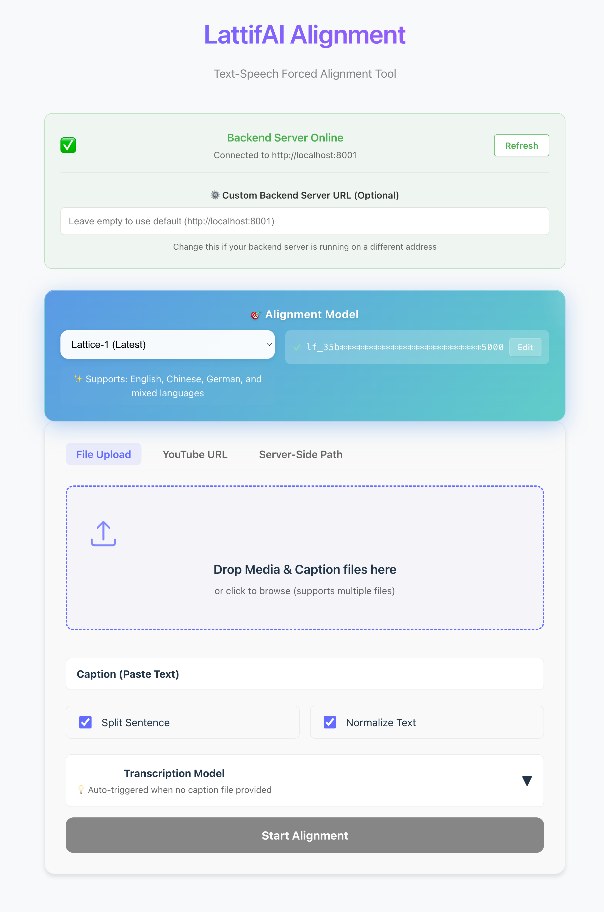

<div align="center">


<h1>LattifAI</h1>
<h3>The Most Accurate Audio-Text Alignment Tool</h3>
<p>Sync subtitles with millisecond precision. Support 100+ languages. Process 20-hour audio.</p>

[](https://badge.fury.io/py/lattifai)
[](https://pepy.tech/project/lattifai)
[](https://pypi.org/project/lattifai)
[](https://opensource.org/licenses/Apache-2.0)
[](https://github.com/lattifai/lattifai-python)

<p>
   🌐 <a href="https://lattifai.com"><b>Website</b></a> •
   🖥️ <a href="https://github.com/lattifai/lattifai-python"><b>GitHub</b></a> •
   🤗 <a href="https://huggingface.co/Lattifai/Lattice-1"><b>Model</b></a> •
   📖 <a href="https://lattifai.com/blogs"><b>Blog</b></a> •
   💬 <a href="https://discord.gg/kvF4WsBRK8"><b>Discord</b></a>
</p>

</div>

---

## 🎯 What is LattifAI?

LattifAI is a **forced alignment engine** that synchronizes text with audio at word-level precision. Powered by the state-of-the-art **[Lattice-1](https://huggingface.co/Lattifai/Lattice-1)** model, it's designed for content creators, developers, and researchers who need perfectly timed subtitles.

**✨ Perfect for:**
- 📹 **YouTubers & Podcasters**: Fix auto-generated subtitles
- 🎬 **Video Editors**: Create professional captions for films
- 🌍 **Translation Teams**: Align multilingual subtitles
- 🔬 **Researchers**: Analyze speech with precise timing data
- 🏢 **Enterprises**: Automate subtitle production at scale

<!--
TODO: Add demo GIF/video here showing before/after alignment
Example:

*Left: Misaligned subtitles | Right: LattifAI precision alignment*
-->

---

## 🚀 Quick Start (3 Steps)

### 1️⃣ Install

```bash
pip install lattifai
```

### 2️⃣ Get Free API Key

Get your free API key at [lattifai.com/dashboard/api-keys](https://lattifai.com/dashboard/api-keys)

```bash
export LATTIFAI_API_KEY="lf_your_api_key_here"
```

### 3️⃣ Align in 5 Lines

```python
from lattifai import LattifAI

client = LattifAI()
caption = client.alignment(
    input_media="audio.wav",
    input_caption="subtitle.srt",
    output_caption_path="aligned.srt"
)
```

**Done!** Your perfectly aligned subtitles are in `aligned.srt` 🎉

<details>
<summary><b>📹 One-Click YouTube Alignment</b></summary>

```bash
# Download + Align YouTube video automatically
lai alignment youtube "https://youtube.com/watch?v=VIDEO_ID"
```

</details>

<details>
<summary><b>🖥️ Web Interface (No Code Required)</b></summary>

```bash
lai-app-install  # One-time setup
lai-server       # Start backend
lai-app          # Start web UI (opens in browser)
```



</details>

---

## 💡 Why LattifAI?

### 🆚 Comparison with Alternatives

| Feature | LattifAI | Whisper | Gentle | aeneas |
|---------|----------|---------|--------|--------|
| **Accuracy** | ⭐⭐⭐⭐⭐ State-of-the-art | ⭐⭐⭐⭐ Very good | ⭐⭐⭐ Good | ⭐⭐ Basic |
| **Languages** | 100+ (via multi-model) | 99 | English only | 10+ |
| **Speed (GPU)** | ~18s for 30min audio | ~60s | ~120s | ~90s |
| **Long Audio** | ✅ Up to 20 hours | ❌ Memory issues | ❌ <1 hour | ❌ Slow |
| **Word-Level** | ✅ Sub-100ms precision | ✅ Good | ✅ Good | ❌ Segment only |
| **Speaker Diarization** | ✅ Built-in | ❌ External tool needed | ❌ No | ❌ No |
| **Format Support** | ✅ 30+ formats | ⚠️ Limited | ⚠️ Limited | ⚠️ Limited |
| **Production Ready** | ✅ Battle-tested | ✅ Yes | ⚠️ Maintenance mode | ⚠️ Unmaintained |

<!--
TODO: Add performance comparison chart
Example:

-->

### ⚡ Key Advantages

- **🎯 Unmatched Accuracy**: Lattice-1 model achieves <50ms average timing error
- **🚀 Blazing Fast**: 10x faster than CPU-only tools with GPU acceleration
- **🌍 True Multilingual**: Not just transcription - alignment works across 100+ languages
- **💪 Production Scale**: Process 20-hour podcasts with <10GB RAM via streaming mode
- **🔧 Zero Lock-in**: Open format support means your data is always portable

---

## 🎬 Use Cases

<table>
<tr>
<td width="33%" align="center">
<h3>🎥 Content Creation</h3>
<p>Fix YouTube auto-captions in seconds. Perfect for creators who need accurate subtitles without manual timing.</p>
</td>
<td width="33%" align="center">
<h3>🌐 Localization</h3>
<p>Align translated subtitles to original audio. Essential for subtitle translation teams.</p>
</td>
<td width="33%" align="center">
<h3>📊 Speech Research</h3>
<p>Extract word-level timing for phonetic analysis. Used by linguistics researchers worldwide.</p>
</td>
</tr>
<tr>
<td width="33%" align="center">
<h3>🎓 E-Learning</h3>
<p>Create accessible course materials with precise captions for hearing-impaired students.</p>
</td>
<td width="33%" align="center">
<h3>🎙️ Podcast Production</h3>
<p>Generate searchable transcripts with accurate timestamps for episode show notes.</p>
</td>
<td width="33%" align="center">
<h3>🏢 Enterprise Media</h3>
<p>Automate subtitle workflows for corporate video libraries at massive scale.</p>
</td>
</tr>
</table>

<!--
TODO: Add customer logos/testimonials
Example:
## 🌟 Trusted By

[Logo Wall of Companies/Projects]
-->

---

## ✨ Core Features

<table>
<tr>
<td width="50%">

### 🎯 Forced Alignment
- **Word-level precision** (<100ms accuracy)
- **Segment-level** timing correction
- **Smart sentence splitting** with punctuation awareness
- **Multi-strategy alignment** (entire/transcription/hybrid)

### 🌍 Multi-Model Transcription
- **Gemini** (100+ languages via API)
- **NVIDIA Parakeet** (24 European languages)
- **Alibaba SenseVoice** (5 Asian languages)
- **Auto-selection** based on language

</td>
<td width="50%">

### 🎤 Speaker Diarization
- **Automatic speaker detection** (pyannote.audio)
- **Label preservation** from input captions
- **Smart name extraction** (Gemini integration)
- **Configurable speaker count** (min/max)

### 🚀 Production Features
- **Streaming mode** (up to 20-hour audio)
- **GPU acceleration** (CUDA/MPS/CPU)
- **30+ subtitle formats** (SRT, VTT, ASS, JSON, etc.)
- **YouTube integration** (download + align in one command)

</td>
</tr>
</table>

<details>
<summary><b>📋 Full Feature List</b></summary>

| Feature | Status | Description |
|---------|--------|-------------|
| ✅ **Forced Alignment** | Production | Precise word/segment-level synchronization |
| ✅ **Multi-Model Transcription** | Production | Gemini, Parakeet, SenseVoice support |
| ✅ **Speaker Diarization** | Production | Multi-speaker ID with label preservation |
| ✅ **Audio Preprocessing** | Production | Multi-channel, device optimization |
| ✅ **Streaming Mode** | Production | Process up to 20-hour audio |
| ✅ **Smart Text Processing** | Production | Sentence splitting, non-speech detection |
| ✅ **Universal Formats** | Production | 30+ caption/subtitle formats |
| ✅ **Configuration System** | Production | YAML-based reproducible workflows |
| 🚧 **Real-time Alignment** | Beta | Live streaming alignment |
| 🔮 **Audio Event Detection** | Planned | Auto-detect [MUSIC], [APPLAUSE], etc. |

</details>

---

## 📦 Installation & Setup

<details open>
<summary><b>Method 1: pip (Recommended)</b></summary>

```bash
# Install LattifAI
pip install lattifai

# Set up API key (get free key at https://lattifai.com/dashboard/api-keys)
export LATTIFAI_API_KEY="lf_your_api_key_here"

# Optional: Gemini API key for transcription
export GEMINI_API_KEY="your_gemini_api_key"  # Get at https://aistudio.google.com/apikey
```

</details>

<details>
<summary><b>Method 2: uv (10-100x faster)</b></summary>

```bash
# Install uv package manager
curl -LsSf https://astral.sh/uv/install.sh | sh

# Create project and install
uv init my-project && cd my-project
uv pip install lattifai

# Activate environment
source .venv/bin/activate
```

</details>

<details>
<summary><b>Method 3: Docker (Coming Soon)</b></summary>

```bash
# Pull and run (Coming Soon)
docker run -it lattifai/lattifai:latest lai --help
```

</details>

---

## 📚 Usage Examples

### 🎯 Basic Alignment (Python)

```python
from lattifai import LattifAI

client = LattifAI()

# Align existing subtitles with audio
caption = client.alignment(
    input_media="podcast.mp3",
    input_caption="rough_transcript.srt",
    output_caption_path="aligned.srt",
    split_sentence=True  # Intelligently split long segments
)

# Access results
for segment in caption.supervisions:
    print(f"{segment.start:.2f}s - {segment.end:.2f}s: {segment.text}")
```

### 🌐 YouTube Auto-Alignment (CLI)

```bash
# Download YouTube video + auto-downloaded captions, then align
lai alignment youtube "https://youtube.com/watch?v=dQw4w9WgXcQ"

# With custom output directory
lai alignment youtube "https://youtube.com/watch?v=VIDEO_ID" \
    media.output_dir=~/Downloads \
    caption.output_path=aligned.srt
```

### 🎤 Transcribe + Align (One Step)

```bash
# Transcribe audio and align in single command
lai transcribe align audio.wav output.srt \
    transcription.model_name=gemini-2.5-pro \
    caption.word_level=true
```

### 🔧 Advanced Configuration

```python
from lattifai import LattifAI, AlignmentConfig, CaptionConfig, DiarizationConfig

client = LattifAI(
    alignment_config=AlignmentConfig(
        device="cuda",  # Use GPU acceleration
    ),
    caption_config=CaptionConfig(
        split_sentence=True,
        word_level=True,  # Export word-level timestamps
        normalize_text=True
    ),
    diarization_config=DiarizationConfig(
        enabled=True,  # Detect multiple speakers
        min_speakers=2,
        max_speakers=4
    )
)

caption = client.alignment(
    input_media="interview.mp4",
    input_caption="transcript.srt",
    output_caption_path="aligned.json",  # JSON preserves word-level data
    streaming_chunk_secs=600  # For long audio (20+ hours)
)
```

<details>
<summary><b>🌍 More Examples: Multi-Language, Long Audio, Speaker Diarization</b></summary>

**Multi-Language Alignment:**
```python
# Align Chinese subtitles
caption = client.alignment(
    input_media="chinese_video.mp4",
    input_caption="chinese_subs.srt",
    output_caption_path="aligned_zh.srt"
)
```

**Long-Form Audio (Podcasts/Audiobooks):**
```python
# Process 10-hour podcast with streaming
caption = client.alignment(
    input_media="long_podcast.mp3",
    input_caption="transcript.srt",
    streaming_chunk_secs=600,  # 10-minute chunks (reduces RAM usage)
    output_caption_path="aligned.srt"
)
```

**Speaker Diarization:**
```bash
# Detect and label speakers automatically
lai alignment align interview.wav transcript.srt output.srt \
    diarization.enabled=true \
    diarization.device=cuda \
    diarization.min_speakers=2 \
    diarization.max_speakers=4
```

**Format Conversion:**
```bash
# Convert between any supported formats
lai caption convert input.srt output.vtt
lai caption convert input.ass output.json  # Preserves word-level data
```

</details>

---

## 🛠️ Supported Formats & Languages

### 📝 Caption Formats (30+)

<table>
<tr>
<td width="25%"><b>Standard Formats</b></td>
<td width="75%">SRT, VTT (WebVTT), ASS, SSA, SUB, SBV, TTML, DFXP</td>
</tr>
<tr>
<td><b>Professional</b></td>
<td>Premiere Pro, Final Cut Pro XML, Avid, Adobe Audition</td>
</tr>
<tr>
<td><b>Research</b></td>
<td>TextGrid (Praat), Audacity Labels, JSON, CSV, TSV</td>
</tr>
<tr>
<td><b>Platforms</b></td>
<td>YouTube, Gemini API format, custom text formats</td>
</tr>
</table>

### 🌍 Languages (100+)

<table>
<tr>
<td width="30%"><b>Gemini Models</b><br>(100+ languages)</td>
<td width="70%">English, Chinese, Spanish, French, German, Japanese, Korean, Arabic, Russian, Hindi, Portuguese, Italian, Dutch, Turkish, Polish, and 85+ more</td>
</tr>
<tr>
<td><b>NVIDIA Parakeet</b><br>(24 European)</td>
<td>English, French, German, Spanish, Italian, Portuguese, Dutch, Polish, Russian, Ukrainian, Czech, and more</td>
</tr>
<tr>
<td><b>Alibaba SenseVoice</b><br>(5 Asian)</td>
<td>Chinese (Mandarin), English, Japanese, Korean, Cantonese</td>
</tr>
</table>

> 💡 **Tip**: Alignment works on ANY language - transcription model selection only matters if you're generating captions from scratch.

---

## ⚡ Performance

### 📊 Speed Benchmarks

**Test setup**: 30-minute podcast audio, RTX 4090 / M4 Mac

| Device | Processing Time | Real-time Factor |
|--------|----------------|------------------|
| 🚀 **NVIDIA RTX 4090** | ~18 seconds | **100x faster** |
| 🍎 **Apple M4 (MPS)** | ~26 seconds | **69x faster** |
| 💻 **CPU (16-core)** | ~3 minutes | **10x faster** |

### 💾 Memory Usage

| Audio Length | Streaming Mode | RAM Usage |
|--------------|----------------|-----------|
| <1 hour | Disabled (default) | ~4 GB |
| 1-5 hours | 600s chunks | ~5 GB |
| 5-20 hours | 600s chunks | ~6 GB |

> 🔥 **Pro tip**: Enable `streaming_chunk_secs=600` for audio >1 hour to reduce memory by 50%+

---

## 📖 CLI Reference

<details>
<summary><b>📋 Command Overview</b></summary>

| Command | Description |
|---------|-------------|
| `lai alignment align` | Align local audio/video with caption |
| `lai alignment youtube` | Download & align YouTube content |
| `lai transcribe run` | Transcribe audio/video to caption |
| `lai transcribe align` | Transcribe + align in one step |
| `lai caption convert` | Convert between caption formats |
| `lai caption shift` | Shift caption timestamps |
| `lai-server` | Start FastAPI web server |
| `lai-app` | Launch web UI |

</details>

<details>
<summary><b>🎯 lai alignment align</b></summary>

```bash
# Basic usage
lai alignment align <audio> <caption> <output>

# Examples
lai alignment align audio.wav caption.srt output.srt
lai alignment align video.mp4 subs.vtt output.srt alignment.device=cuda
lai alignment align audio.wav caption.srt output.json \
    caption.split_sentence=true \
    caption.word_level=true
```

**Common Parameters:**
- `alignment.device=cuda|mps|cpu` - Device for processing
- `caption.split_sentence=true` - Smart sentence splitting
- `caption.word_level=true` - Export word-level timestamps
- `media.streaming_chunk_secs=600` - Enable streaming for long audio

</details>

<details>
<summary><b>📹 lai alignment youtube</b></summary>

```bash
# Basic usage
lai alignment youtube <url>

# Examples
lai alignment youtube "https://youtube.com/watch?v=VIDEO_ID"
lai alignment youtube "https://youtube.com/watch?v=VIDEO_ID" \
    media.output_dir=~/Downloads \
    caption.output_path=aligned.srt \
    diarization.enabled=true
```

</details>

<details>
<summary><b>🎤 lai transcribe align</b></summary>

```bash
# Transcribe and align in one step
lai transcribe align <input> <output>

# Examples
lai transcribe align audio.wav output.srt
lai transcribe align video.mp4 output.srt \
    transcription.model_name=gemini-2.5-pro \
    transcription.gemini_api_key=YOUR_KEY \
    alignment.device=cuda \
    caption.word_level=true
```

**Transcription Models:**
- `gemini-2.5-pro` - Google Gemini (requires API key)
- `nvidia/parakeet-tdt-0.6b-v3` - NVIDIA Parakeet
- `iic/SenseVoiceSmall` - Alibaba SenseVoice

</details>

---

## 🏗️ Architecture

LattifAI uses a modular, config-driven architecture powered by `nemo_run`:

```
┌─────────────────────────────────────────────────────────────┐
│                      LattifAI Client                        │
├─────────────────────────────────────────────────────────────┤
│  Configuration Layer (nemo_run Configs)                     │
│  ├── ClientConfig      → API settings                       │
│  ├── AlignmentConfig   → Lattice-1 model & device           │
│  ├── CaptionConfig     → I/O formats & processing           │
│  ├── TranscriptionConfig → ASR model selection              │
│  └── DiarizationConfig → Speaker detection                  │
├─────────────────────────────────────────────────────────────┤
│  Core Components                                            │
│  ├── AudioLoader      → Load & preprocess audio             │
│  ├── Aligner          → Lattice-1 forced alignment          │
│  ├── Transcriber      → Multi-model ASR                     │
│  ├── Diarizer         → Speaker identification              │
│  └── Tokenizer        → Text segmentation                   │
└─────────────────────────────────────────────────────────────┘
```

**Design Principles:**
- ✅ **Config-driven**: Declarative, composable, reproducible
- ✅ **Modular**: Swap components without breaking workflows
- ✅ **Extensible**: Add custom transcription models easily
- ✅ **Production-ready**: Battle-tested on diverse content

---

## 🗺️ Roadmap

| Quarter | Release | Features |
|---------|---------|----------|
| **Q4 2025** ✅ | **Lattice-1** | English/Chinese/German alignment<br>Multi-model transcription<br>Speaker diarization<br>Web UI |
| **Q1 2026** 🚧 | **Lattice-2** | 40+ languages<br>Real-time streaming<br>Audio event detection |
| **Q2 2026** 📋 | **Lattice-3** | Multi-modal alignment (video+audio+text)<br>Emotion/tone detection<br>Browser extension |

**Legend**: ✅ Released | 🚧 In Development | 📋 Planned

> 📣 Want to influence our roadmap? [Join our Discord](https://discord.gg/kvF4WsBRK8) or [open a feature request](https://github.com/lattifai/lattifai-python/issues/new)!

---

## 🤝 Contributing

We welcome contributions! Here's how to get started:

```bash
# 1. Clone and setup
git clone https://github.com/lattifai/lattifai-python.git
cd lattifai-python
uv sync  # or: pip install -e ".[dev]"

# 2. Install pre-commit hooks
pre-commit install

# 3. Make changes and test
pytest --cov=src

# 4. Submit PR
# See CONTRIBUTING.md for detailed guidelines
```

**Good First Issues**: Check out issues labeled [`good first issue`](https://github.com/lattifai/lattifai-python/labels/good%20first%20issue)

---

## 📄 License

Apache License 2.0 - see [LICENSE](LICENSE) for details

---

## 💬 Support & Community

<table>
<tr>
<td width="33%" align="center">
<h3>💬 Discord</h3>
<a href="https://discord.gg/kvF4WsBRK8">Join our community</a><br>
Get help, share projects, discuss features
</td>
<td width="33%" align="center">
<h3>🐛 GitHub Issues</h3>
<a href="https://github.com/lattifai/lattifai-python/issues">Report bugs</a><br>
Request features, technical support
</td>
<td width="33%" align="center">
<h3>💡 Discussions</h3>
<a href="https://github.com/lattifai/lattifai-python/discussions">Q&A Forum</a><br>
Ask questions, show off projects
</td>
</tr>
</table>

---

## 🌟 Star History

[](https://star-history.com/#lattifai/lattifai-python&Date)

---

<div align="center">

**Made with ❤️ by the LattifAI Team**

[⭐ Star us on GitHub](https://github.com/lattifai/lattifai-python) • [🐦 Follow on Twitter](https://twitter.com/lattifai) • [📧 Contact](mailto:tech@lattifai.com)

</div>
